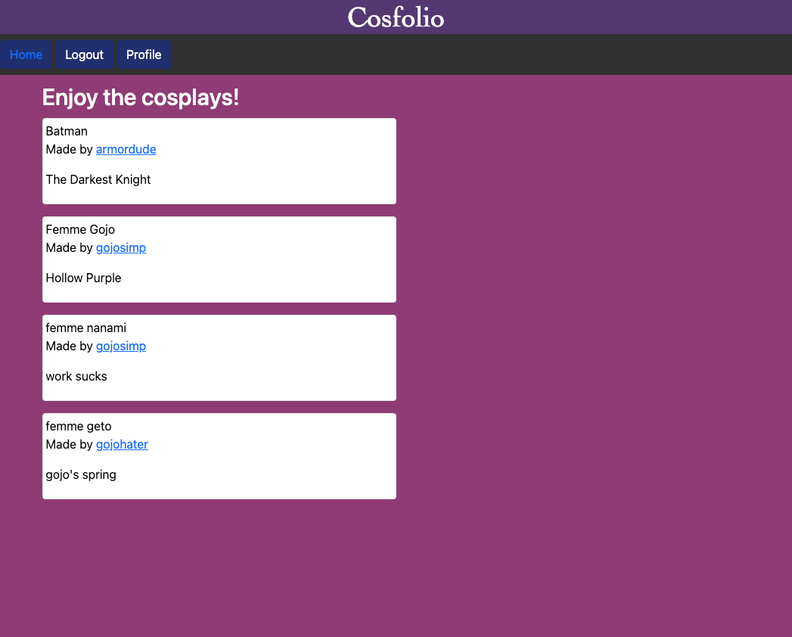
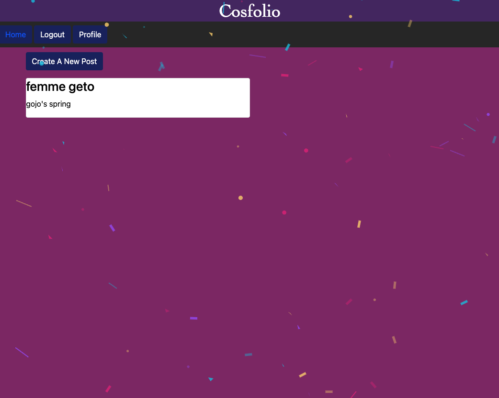
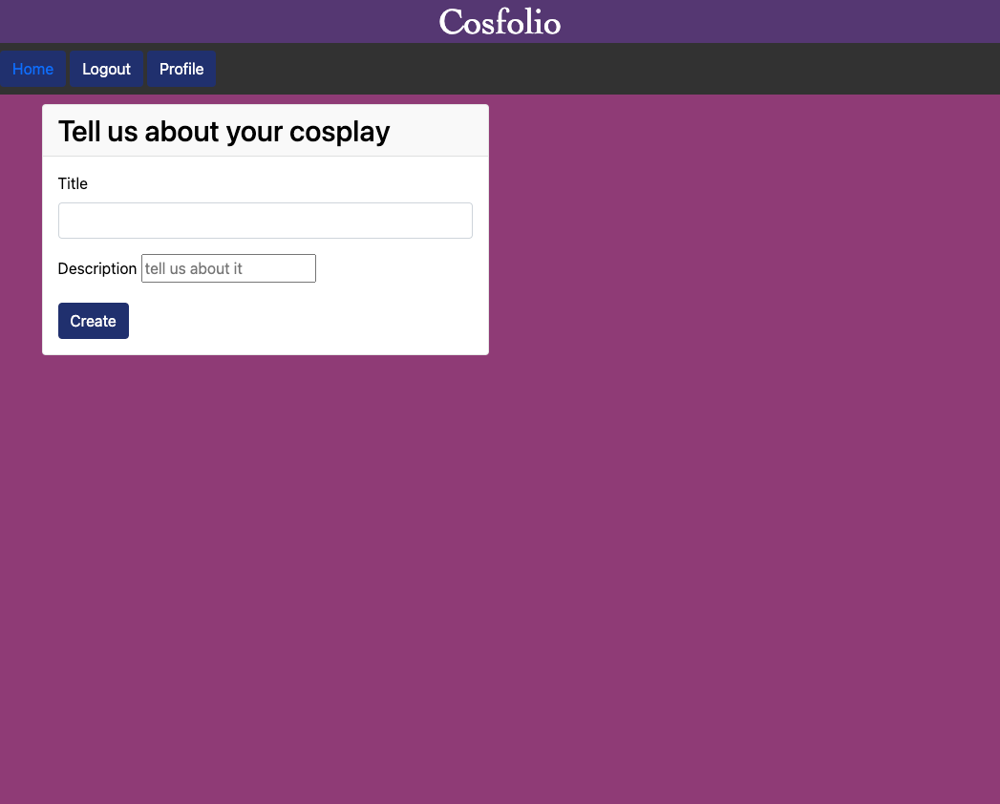

# Cosfolio: A Cosplace

## Descripton

Welcome to Cosfolio! A sweet, little forum where you can save and share your cosplays as well as become part of a kind cosplay community.

Create an account and keep a digital collection of all the cosplays that you have created! Once a user has created an account they will be able to view other user's cosplay creations as well!

## Table of Contents

- [Installation](#installation)
- [Usage](#usage)
- [Credits](#credits)
- [Collaborators](#collaborators)
- [License](#license)

## Installation

To run this application, first download the repository and open in your preferred code editor. Run `npm install` to download the necessary npm package dependencies. These dependencies can be found listed in the package.json file.

Before entering your MySQL shell you will need to create your own dotenv file with the following information:

    DB_NAME: 'cosplay_db'
    DB_USER: '(your MySQL username)'
    DB_PASSWORD: '(your MySQL password)'
    SESSION_SECRET='(the session secret)'

This is necessary to be able to connect to the database while also keeping your private information separate from the code.

In your MySQL shell create the database locally by running `source db/schema.sql` this will also initiate use of the database as the schema.sql file also contains the code to focus on the correct database; `USE (database)_db`.

After closing the MySQL shell, navigate to the main repository in the command line and run `npm run seed` to seed the database and then run `npm run start` to initialize the application.

## Usage

The deployed site can be viewed [here](https://cosfolio-cbc30e9a9851.herokuapp.com/). The homepage displays various cosplays created by different users of the site. Once a user logs in they can view the usernames of the other users associated with the cosplays on the homepage.

In the navbar users, once logged in, can click the Profile button to view the cosplays created by them.

Their profile page will also have a 'Create' button they can click to add a new cosplay to their profile.

## Credits

Badges sourced from: [Awesome Badges](https://dev.to/envoy_/150-badges-for-github-pnk)

[Props](https://icons8.com/icon/Pe2wpiAIWb3h/props) icon by [Icons8](https://icons8.com)

### Collaborators

Tay Campanelli  
-Github: [Camparooni](https://github.com/Camparooni) 
Amber Diehl  
-GitHub: [AmberDiehl1](https://github.com/AmberDiehl1) 
Richard Warden  
-GitHub: [r-warden](https://github.com/r-warden) 
Paige Carroll  
-GitHub: [sillytsundere](https://github.com/sillytsundere) 

## License

MIT License

## Badges

## Future Developments

These are a few of the application features that we would like to add in the future:

- Enabling users to edit and delete their cosplay posts
- Allowing users to comment on other user's cosplays
- Having the confetti animation activate only on the user's first login and profile visit
- Allowing users to add images to their cosplay posts
